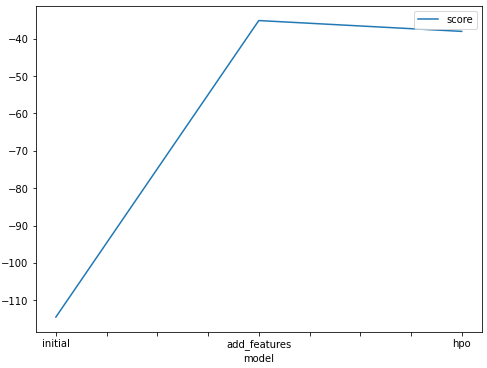
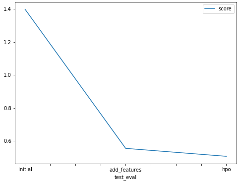

# Report: Predict Bike Sharing Demand with AutoGluon Solution
#### Sana Elwaar

## Initial Training
### What did you realize when you tried to submit your predictions? What changes were needed to the output of the predictor to submit your results?
I had not access to the gateway, and decided to run it on google colab. The first results were  so bad with scores near 1.4. But after feature engineering, results are better. I had to read additional documentation to be able to apply the hyperparameters optimization.

### What was the top ranked model that performed?
The model with top score is the last one (new features and hyperparameters optimization) even if its training score was worse than the second one. This was a predictible result as that model benefits from both enhancments.

## Exploratory data analysis and feature creation
### What did the exploratory analysis find and how did you add additional features?
I only used the data exploratory analysis to confirm that no major class distributions in the features I use. And to check that for the new features I created. Findings: uniform distribution for seasons, normal for tempurature and humidity, majour class for holiday flag, and a shif to the left for the windspeed (you won't be willing to ride a bike when it is windy :) ). The target follows an exponential distribution, without majour classes (values), the problem is well a regresion (in contrast to classification). The datetime could not be shown in a histogram, it constitute a base for feature engineering. 

### How much better did your model preform after adding additional features and why do you think that is?
Much better: in terms of MSE and score. The seasonality based in the hour in the day (working hour vs sleeping hours) were nowhere represented by the other features (holiday/weekday, temperature), and is a very relevant information. Moreover, the grannularity of the day is better to capture the customer behaviour change following the day in the month (begening/end). 

## Hyper parameter tuning
### How much better did your model preform after trying different hyper parameters?
A slight change in terms of kaggle score (the model generelize better i.e overfits less) even if, it has higher MSE. 

### If you were given more time with this dataset, where do you think you would spend more time?
Add more features. 

### Create a table with the models you ran, the hyperparameters modified, and the kaggle score.
|model|hp-method|presets|timelimit|score
|--|--|--|--|--|
|initial|none|best_quality|600|1.39806
|add_features|none|best_quality|600|0.55471
|hpo|tabular-AutoGluon|best_quality|600|0.50664

### Create a line plot showing the top model score for the three (or more) training runs during the project.

### Create a line plot showing the top kaggle score for the three (or more) prediction submissions during the project.

## Summary
The huge step in enhacing the model's performance was made when adding new features, specially working hours, and that's due to EDA. In the future I will be paying more attention to the EDA and wether or not the full potential of features I have is used.
